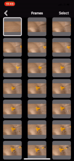

# WIZPhotoCollectionEditorController

- Simply create controller for edition photo collection
- Drag&drop, export images, remove them and zoom

HOW TO INSTALL

Import files from the folder "WIZPhotoCollectionEditorController Obj-C" to your project

EXAMPLE TO USE

~~~
	WIZPhotoCollectionEditorController *photosController = [[WIZPhotoCollectionEditorController alloc] init];

	[photosController setProperties:@[@(kEditorPropertyZoom),@(kEditorPropertyDragNDrop)]];

	[photosController selectImage:0];

	[photosController setPhotos:photosArray];

	photosController.cellBackgroundColor = [UIColor colorWithWhite:1.0 alpha:0.4];

	photosController.deleteImages = ^(NSArray<NSNumber *> * _Nonnull indexes) {
	};

	[self.navigationController showViewController:photosController sender:nil];

~~~

**properties**

-(void)setProperties:(NSArray <NSNumber*>*)properties;

Methode include properties for use controller

- kEditorPropertyZoom - enable zoom
- kEditorPropertyDragNDrop - enable drag&drop

**select frame**

-(void)selectImage:(int)selectIndex;

Method for select frame from outside

**callbacks** 
 - *selectImage* - return index of selected cell
 - *dragNDropAction* - return fromIndex and toIndex
 - *deleteImages* - return array with indexes of selected cells

